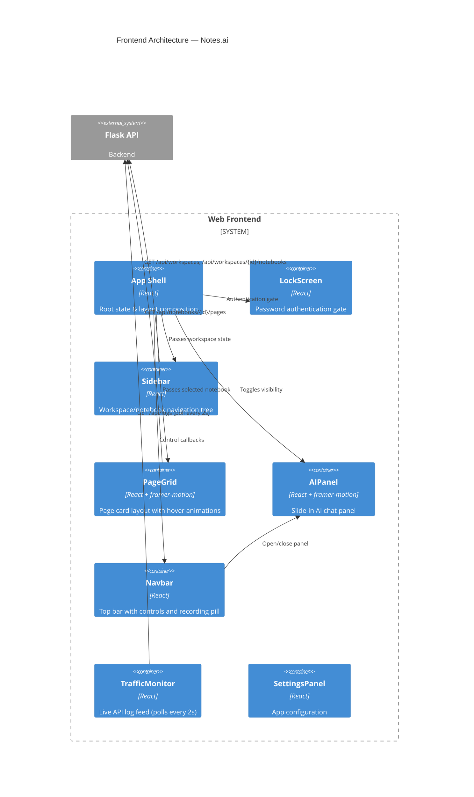
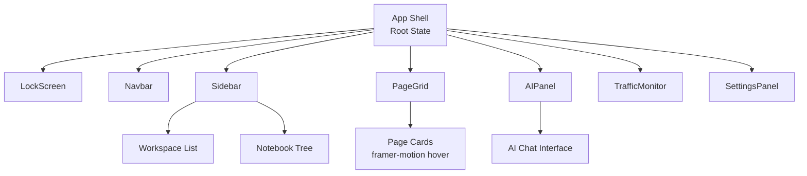
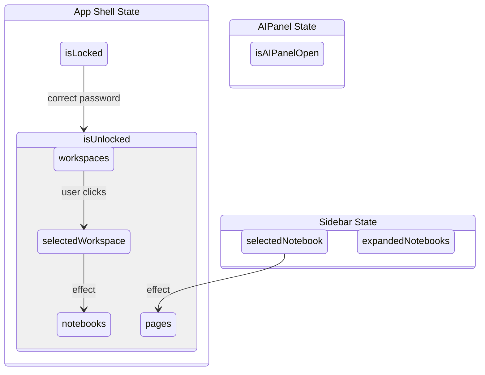
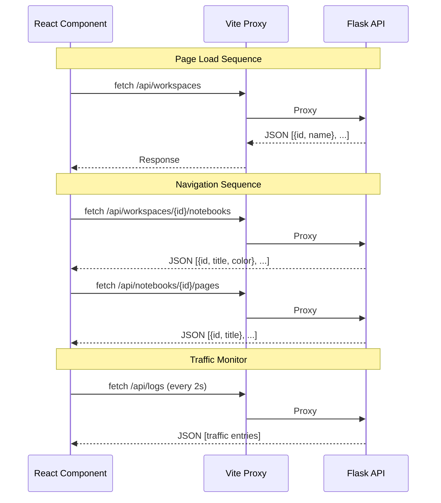

<div align="center">
  
  
  
  
  
  <br/><br/>
  <h1>🌐 Notes.ai — Web Frontend</h1>
  <p><strong>React 18 single-page application · Read-only note browser · Live traffic monitor</strong></p>
</div>

---

## 📋 Table of Contents

- [Architecture Overview](#-architecture-overview)
- [Component Tree](#-component-tree)
- [State Management](#-state-management)
- [API Integration](#-api-integration)
- [Styling & Animation](#-styling--animation)
- [Getting Started](#-getting-started)

---

## 🏛️ Architecture Overview

The frontend is a **React 18 single-page application** built with Vite. It connects to the Flask backend API via Vite's built-in proxy, providing a read-only browsing experience for notes created on the iPad. All data originates from the iOS app via snapshot sync.



---

## 🌳 Component Tree



### Component Responsibilities

| Component | Role | Key Behaviors |
|-----------|------|---------------|
| **App Shell** | Root orchestrator | Manages lock state, workspace/notebook/page selections; composes all sub-views |
| **LockScreen** | Auth gate | Password input with animated UI feedback; unlocks on correct code |
| **Navbar** | Top toolbar | Settings, tools, recording pill indicator, AI panel toggle |
| **Sidebar** | Navigation tree | Expandable workspace > notebook hierarchy; highlights active selection |
| **PageGrid** | Content display | Card grid with hover animations; loads pages on notebook selection |
| **AIPanel** | AI interface | Slide-in panel with framer-motion; future AI chat interface |
| **TrafficMonitor** | Live feed | Polls `/api/logs` every 2s; scrolling list of recent API traffic |
| **SettingsPanel** | Configuration | Theme, notification, and account settings |

---

## 📊 State Management

The application uses **component-local state** with **prop drilling** from the root App shell. No external state library is required.



### State Inventory

| Variable | Type | Initial | Updated By |
|----------|------|---------|------------|
| `isLocked` | `bool` | `true` | LockScreen on correct code |
| `password` | `string` | `""` | LockScreen input |
| `workspaces` | `array` | `[]` | `useEffect` on unlock → fetch |
| `selectedWorkspace` | `string?` | `null` | Sidebar click |
| `notebooks` | `array` | `[]` | `useEffect` on workspace change |
| `selectedNotebook` | `string?` | `null` | Sidebar click |
| `pages` | `array` | `[]` | `useEffect` on notebook change |
| `expandedNotebooks` | `Set` | `new Set()` | Sidebar expand/collapse |
| `isSelectionMode` | `bool` | `false` | Navbar toggle |
| `isSidebarHidden` | `bool` | `false` | Navbar toggle |
| `isAIPanelOpen` | `bool` | `false` | Navbar toggle |

---

## 🔌 API Integration

All API calls are proxied through Vite's dev server to avoid CORS issues in development.



### Vite Configuration

```js
// vite.config.js
{
  proxy: { "/api": "" },
  plugins: ["@vitejs/plugin-react"],
}
```

### Package Dependencies

| Package | Version | Purpose |
|---------|---------|---------|
| `react` | 18.x | UI framework |
| `react-dom` | 18.x | DOM rendering |
| `framer-motion` | 11.x | Animations & transitions |
| `lucide-react` | 0.344 | Icon library |
| `vite` | 5.x | Build tool & dev server |
| `@vitejs/plugin-react` | 4.x | React integration |

---

## 🎨 Styling & Animation

| Feature | Implementation |
|---------|---------------|
| **Page Cards** | Grid layout with hover scale/opacity transitions via framer-motion |
| **AIPanel** | Slide-in/out animation with spring physics |
| **LockScreen** | Animated feedback on incorrect attempts |
| **Icons** | lucide-react for all UI icons |
| **Layout** | CSS Flexbox/Grid via index.css |
| **Typography** | System font stack, monospace for traffic monitor |

---

## 🚀 Getting Started

```bash
# Install dependencies
npm install

# Start development server
npm run dev        # → vite --host (default: localhost:5173)

# Build for production
npm run build      # → vite build (outputs to dist/)

# Preview production build
npm run preview    # → vite preview
```

The dev server automatically proxies `/api/*` requests to the Flask backend.

---

<div align="center">
  <sub>Frontend architecture · Notes.ai</sub>
</div>
