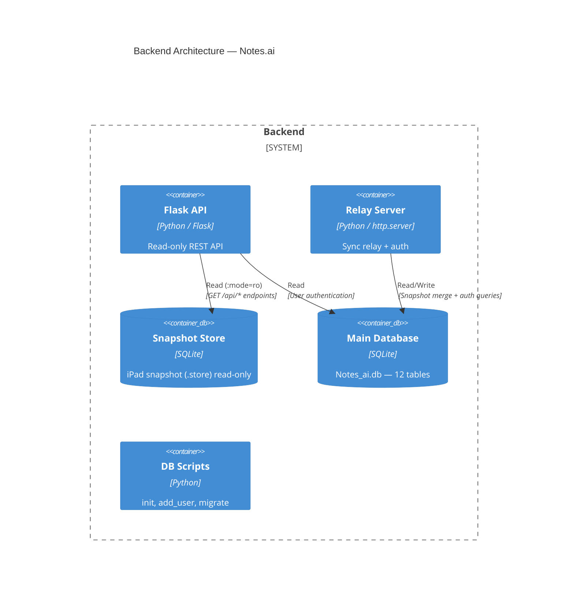
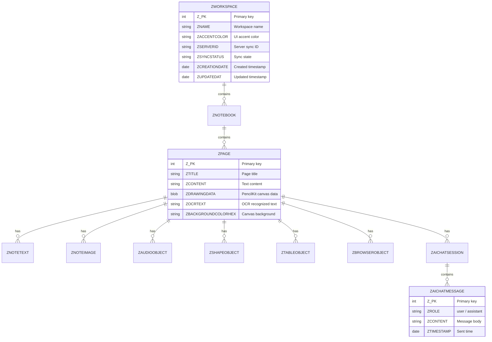
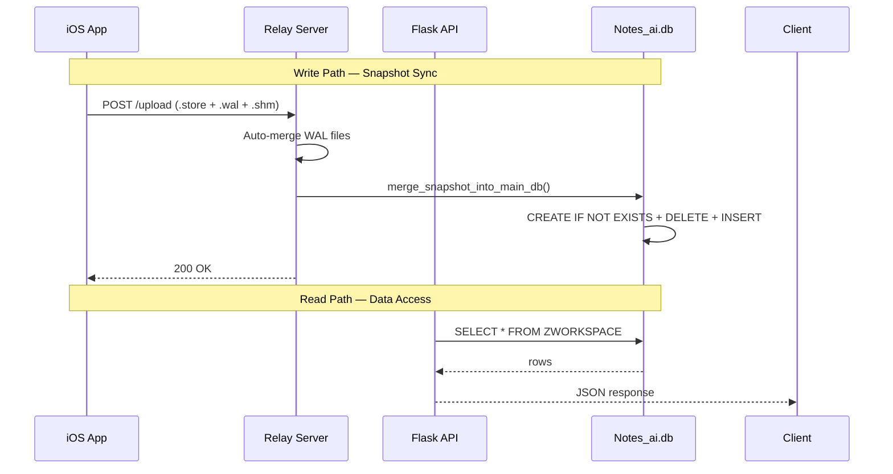

<div align="center">
  
  
  
  <br/><br/>
  <h1>⚙️ Notes.ai — Backend</h1>
  <p><strong>Two-server Python architecture · Snapshot sync relay · Read-only data API</strong></p>
</div>

---

## 📋 Table of Contents

- [Architecture Overview](#-architecture-overview)
- [Server Components](#-server-components)
- [API Reference](#-api-reference)
- [Database Schema](#-database-schema)
- [Data Flow](#-data-flow)
- [Deployment](#-deployment)

---

## 🏛️ Architecture Overview

The backend consists of **two independent Python servers** sharing a single SQLite database. The Flask API provides read-only data access for the web frontend, while the Relay Server handles snapshot ingestion from the iOS app and user authentication.



---

## 🖥️ Server Components

### Flask API Server (`app.py`)

| Attribute | Value |
|-----------|-------|
| **Framework** | Flask (Python) |
| **Mode** | Read-only data access |
| **Database Access** | Snapshot `.store` (read-only `:mode=ro`) + `Notes_ai.db` (users) |

Serves as the data gateway for the web frontend and iOS app. All write operations are handled indirectly through the snapshot sync pipeline.

### Relay Server (`relay.py`)

| Attribute | Value |
|-----------|-------|
| **Framework** | `http.server.BaseHTTPRequestHandler` |
| **Mode** | Read-write, sync ingestion |
| **Database Access** | `Notes_ai.db` (full read/write) |

Acts as the write endpoint for the iOS app — receives snapshot uploads, merges data into the main database, and handles authentication.

---

## 🔌 API Reference

### Flask API Endpoints

| Method | Path | Description | Source |
|--------|------|-------------|--------|
| `GET` | `/api/workspaces` | List all workspaces | `ZWORKSPACE` |
| `GET` | `/api/workspaces/<id>/notebooks` | List notebooks in workspace | `ZNOTEBOOK` |
| `GET` | `/api/notebooks/<id>/pages` | List pages in notebook | `ZPAGE` |
| `POST` | `/upload` | Receive `.store` snapshot | — |
| `POST` | `/api/auth/login` | Authenticate user | `users` |
| `GET` | `/api/logs` | Recent traffic log | In-memory ring buffer |
| `GET` | `/private` | Serve private web interface | — |

### Relay Server Endpoints

| Method | Path | Description |
|--------|------|-------------|
| `GET` | `/api/sync/list` | List available snapshots |
| `GET` | `/api/cloud/workspaces` | Cloud workspace listing |
| `GET` | `/api/sync/download` | Download snapshot file |
| `GET` | `/api/cloud/download` | Download cloud snapshot |
| `GET` | `/api/cloud/metadata` | Health check |
| `POST` | `/api/auth/login` | Authenticate user |
| `POST` | `/api/auth/signup` | Register new user |
| `POST` | `/*` (catch-all) | Save uploaded file, trigger merge |
| `DELETE` | `/api/sync/delete` | Remove snapshot |
| `DELETE` | `/api/cloud/delete` | Remove cloud snapshot |

---

## 🗄️ Database Schema



### Database Files

| File | Path | Purpose |
|------|------|---------|
| `Notes_ai.db` | `backend/db/` | **Primary database** — 12 tables, all production data |
| `iPad_snapshot.store` | `Sharing/` | Latest iOS snapshot (read-only for Flask API) |

### Utility Scripts

| Script | Path | Purpose |
|--------|------|---------|
| `init_users_db.py` | `backend/db/` | Create `users` table, seed demo user |
| `add_user.py` | `backend/db/` | CLI tool to add/update user accounts |
| `migrate_db.py` | `backend/db/` | Apply schema migrations |

---

## 🔄 Data Flow



---

## 🚀 Deployment

```bash
# Start Flask API
python3 backend/app.py

# Start Relay Server
python3 backend/relay.py
```

---

<div align="center">
  <sub>Backend architecture · Notes.ai</sub>
</div>
