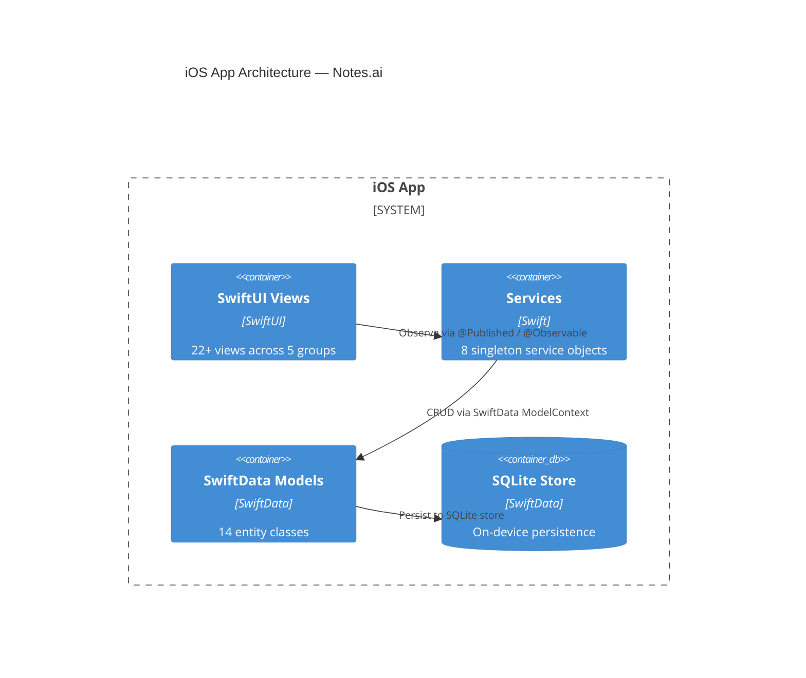
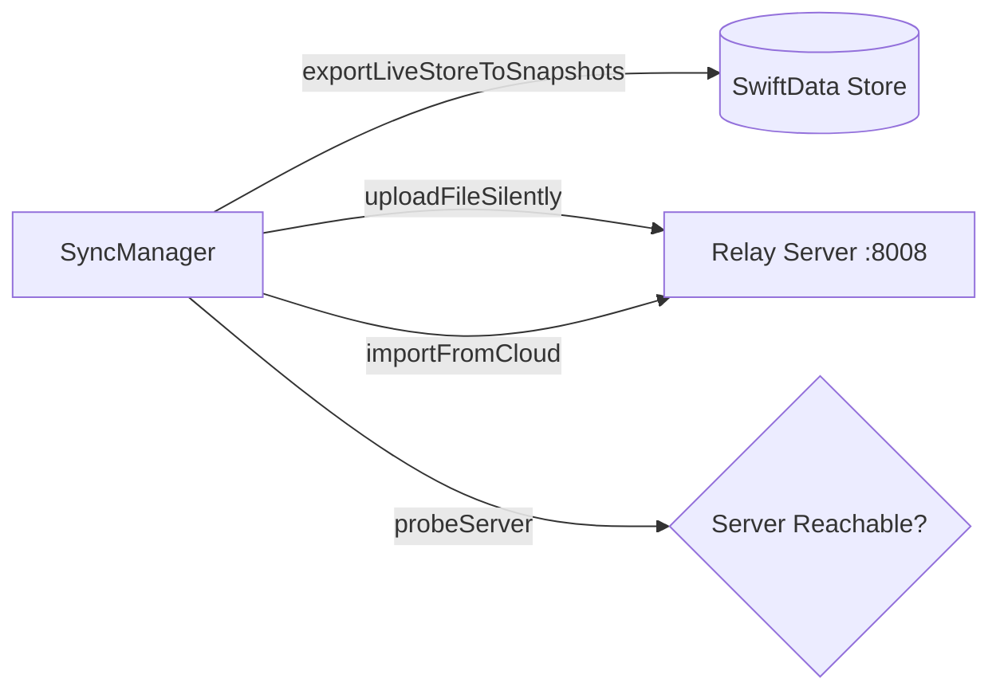
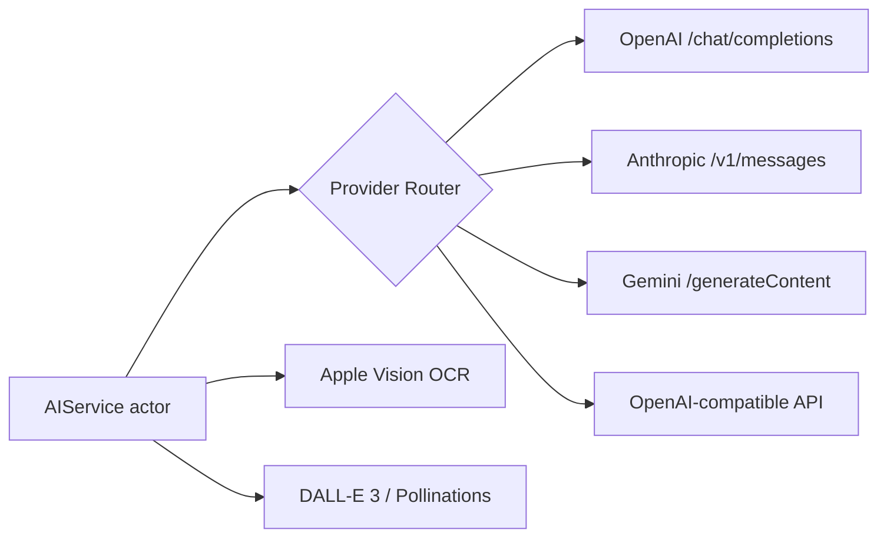
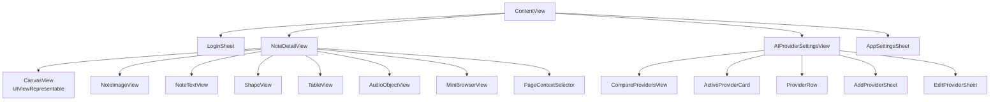
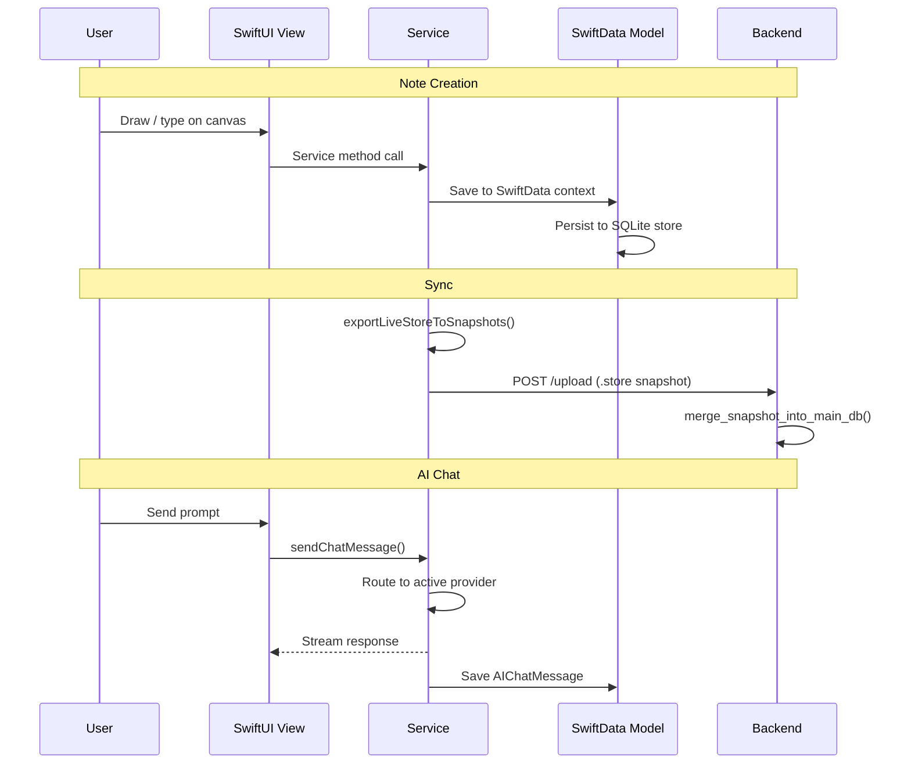

<div align="center">
  
  
  
  
  
  <br/><br/>
  <h1>📱 Notes.ai — iOS App</h1>
  <p><strong>Native iPad application · MVVM + SwiftData + PencilKit · Multi-provider AI</strong></p>
</div>

---

## 📋 Table of Contents

- [Architecture Overview](#-architecture-overview)
- [Model Layer](#-model-layer)
- [Services Layer](#-services-layer)
- [View Layer](#-view-layer)
- [Data Flow](#-data-flow)
- [Design Patterns](#-design-patterns)

---

## 🏛️ Architecture Overview

The iOS app follows **MVVM (Model-View-ViewModel)** with **SwiftData** for persistence and **PencilKit** for freeform canvas drawing. Service classes are implemented as **singletons** observable by SwiftUI via `ObservableObject` or `@Observable`.



---

## 🧩 Model Layer

14 SwiftData entity classes form the data backbone of the application.

```mermaid
erDiagram
  Workspace ||--o{ Notebook : contains
  Notebook ||--o{ Page : contains
  Page ||--o{ NoteImage : has
  Page ||--o{ NoteText : has
  Page ||--o{ AudioObject : has
  Page ||--o{ ShapeObject : has
  Page ||--o{ TableObject : has
  Page ||--o{ BrowserObject : has
  Page ||--o{ AIChatSession : has
  AIChatSession ||--o{ AIChatMessage : contains

  Workspace {
    UUID id
    string name
    string accentColor
    date creationDate
    string serverID "Optional"
    string syncStatus
  }

  Notebook {
    UUID id
    string name
    date creationDate
    string serverID "Optional"
    string syncStatus
  }

  Page {
    UUID id
    string title
    string content
    string ocrText
    binary drawingData "PencilKit canvas"
    string backgroundStyle
    string backgroundColorHex
  }

  NoteImage {
    UUID id
    binary data "External storage"
    float x "Position"
    float y
    float width
    float height
    float zIndex
    float opacity
    bool isLocked
  }

  NoteText {
    UUID id
    string text
    float x, y, width, height
    float fontSize
    string colorHex
    bool isLocked
  }

  AudioObject {
    UUID id
    binary data "External storage"
    string transcription
    float duration
    float x, y
    bool isLocked
  }

  ShapeObject {
    UUID id
    string type "circle, rectangle, triangle..."
    float x, y, width, height
    string colorHex
    bool isFilled
    int zIndex
  }

  TableObject {
    UUID id
    int rows
    int cols
    array cellContent "[[String]]"
    float x, y
  }

  BrowserObject {
    UUID id
    string urlString
    string title
    float x, y, width, height
    bool isLocked
  }

  AIChatSession {
    UUID id
    string title
    date creationDate
  }

  AIChatMessage {
    UUID id
    string role "user | assistant"
    string content
    string imageURL "Optional"
    date timestamp
  }
```

### Supporting Types

| Type | Description |
|------|-------------|
| `AIProvider` | Multi-provider configuration (Codable, Identifiable) |
| `ProviderType` | Enum with 12 provider cases (openai, anthropic, gemini, groq, …) |
| `RecordingSource` | Enum: none, session, aiPrompt |
| `OCRResponse` | Codable struct for Vision framework results |
| `SummarizeResponse` | Codable struct for AI summary responses |

---

## 🔧 Services Layer

Eight singleton services encapsulate all business logic:

### SyncManager


Orchestrates the entire sync lifecycle — exports the live SwiftData store to snapshot files, probes for server connectivity, uploads with retry, and downloads cloud snapshots for restore.

### AIService


A thread-safe actor that routes prompts to the active AI provider, generates images, performs on-device OCR, and assembles context-aware system prompts.

### Service Matrix

| Service | Pattern | Role | Key Dependencies |
|---------|---------|------|------------------|
| **SyncManager** | Singleton @ObservableObject | Sync lifecycle | FileManager, URLSession |
| **AuthService** | Singleton @ObservableObject | Email/password login | URLSession |
| **AIService** | Singleton actor | Multi-provider AI routing | URLSession, Vision |
| **AIProviderStore** | Singleton @MainActor | Provider CRUD, benchmarking | UserDefaults |
| **AudioRecorder** | Singleton @Observable | AVAudioEngine capture | AVFoundation |
| **DrawingSettings** | Singleton @ObservableObject | PencilKit config | PKTool, UIFeedbackGenerator |
| **SecurityService** | Singleton @ObservableObject | FaceID/TouchID lock | LocalAuthentication |
| **TranscriptionService** | Singleton @Observable | Speech-to-text | SFSpeechRecognizer |

---

## 🎨 View Layer

### View Hierarchy



### View Groups

| Group | Views | Purpose |
|-------|-------|---------|
| **Root** | `ContentView` | NavigationSplitView with workspace switcher |
| **Note Editing** | `NoteDetailView`, `CanvasView`, `NoteImageView`, `NoteTextView`, `ShapeView`, `TableView`, `AudioObjectView`, `MiniBrowserView`, `FullScreenImageView`, `RegionSelectorOverlay`, `PageHeaderToolbar`, `PageBackgroundView`, `PageCanvasObjectsLayer` | Full PencilKit canvas with rich object overlays |
| **AI** | `AIProviderSettingsView`, `CompareProvidersView`, `ActiveProviderCard`, `ProviderRow`, `AddProviderSheet`, `EditProviderSheet`, `PageContextSelector`, `AppSettingsSheet` | Multi-provider management and AI chat context |
| **Auth & Settings** | `LoginSheet`, `AccountSettingsView`, `CloudSettingsView`, `PageInfoSheet` | Authentication, sync settings, cloud browsing |
| **Shapes** | `TriangleShape`, `StarShape`, `HexagonShape`, `DiamondShape`, `ArrowShape`, `XYAxisShape`, `XYZAxisShape`, `NumberLineShape`, `ParabolaShape`, `SineWaveShape`, `VectorArrowShape` | Reusable `Shape` protocol implementations |

---

## 🔄 Data Flow



---

## 🧠 Design Patterns

| Pattern | Application |
|---------|-------------|
| **MVVM** | SwiftUI Views observe @Published Services via ObservableObject |
| **Singleton** | All 8 services use shared instance pattern |
| **Actor Isolation** | AIService — thread-safe multi-provider routing |
| **Offline-First** | SwiftData local persistence, syncs when online |
| **Snapshot Sync** | Full SQLite store copy → upload → server merge |
| **Provider Abstraction** | Common interface over 12 AI providers with capability matrix |
| **Repository** | Direct SQLite queries via SwiftData (no separate ORM) |

---

<div align="center">
  <sub>iOS architecture · Notes.ai</sub>
</div>
