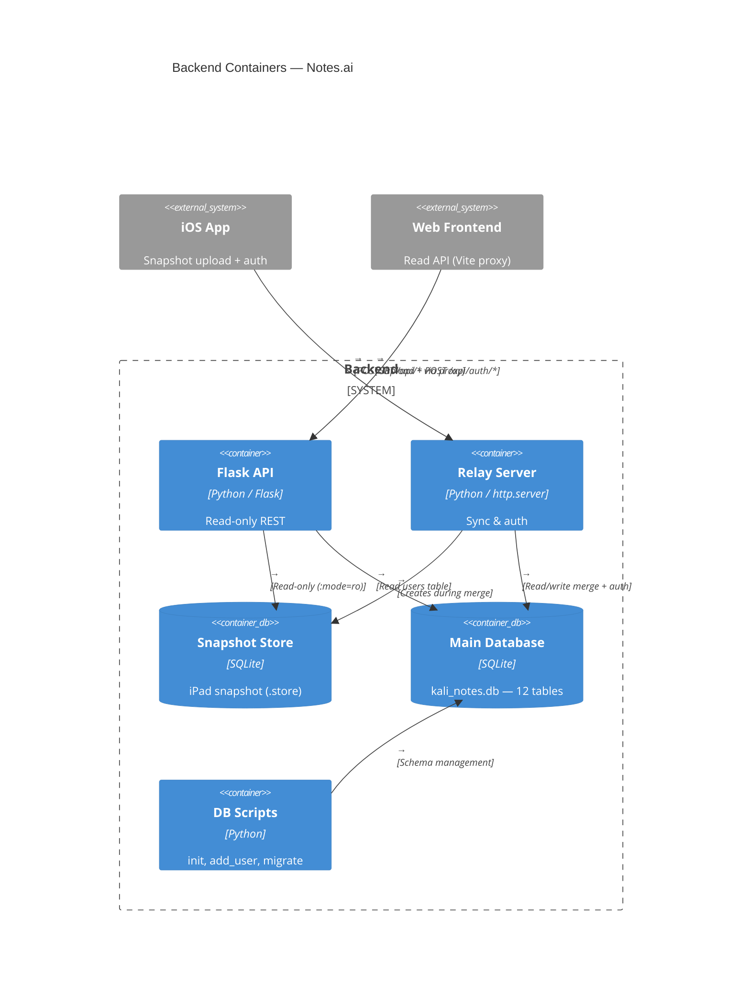

# Notes.ai — Backend Architecture

_2026-05-26_

---

## Backend Architecture
### Read-only REST API server.

Responsibilities:
    - Serve read-only GET endpoints over note hierarchy data.
    - Read from the latest iPad snapshot (.store file) with SQLite read-only mode.
    - Authenticate users via email/password lookup in the users table.
    - Log all traffic with timestamps and status codes (ring buffer, max 50).
    - Serve the private/shared web interface.

Routes:
    - GET /api/workspaces — list all workspaces (source: ZWORKSPACE)
    - GET /api/workspaces/<id>/notebooks — list notebooks in workspace (source: ZNOTEBOOK)
    - GET /api/notebooks/<id>/pages — list pages in notebook (source: ZPAGE)
    - POST /upload — receive .store snapshot file (header: File-Name)
    - POST /api/auth/login — validate email/password credentials
    - GET /api/logs — return recent traffic log entries
    - GET /private — serve the private/shared index page

Interactions:
    - Reads snapshot SQLite store for note data.
    - Reads kali_notes.db for user authentication.
    - Proxied by Vite frontend dev server for cross-origin requests.

---

### Sync relay and authentication server.

Responsibilities:
    - Receive iPad SQLite snapshot uploads via POST.
    - Auto-merge SQLite WAL + SHM files on receipt.
    - Merge snapshot tables into the main kali_notes.db.
    - Serve cloud workspace listing, download, and delete endpoints.
    - Handle user registration and login authentication.

Endpoints:
    - GET /api/sync/list — list available snapshot timestamps and files
    - GET /api/cloud/workspaces — alias for sync/list
    - GET /api/sync/download?timestamp=&ext= — download snapshot file
    - GET /api/cloud/download?timestamp=&ext= — alias for cloud download
    - GET /api/cloud/metadata — simple health check
    - POST /api/auth/login — authenticate existing user
    - POST /api/auth/signup — register new user
    - POST /* (catch-all) — save uploaded file, trigger merge pipeline
    - DELETE /api/sync/delete?timestamp= — remove snapshot triple
    - DELETE /api/cloud/delete?timestamp= — alias for sync delete
    - OPTIONS * — CORS preflight response

Interactions:
    - Receives snapshot files from iOS SyncManager.
    - Merges snapshot data into kali_notes.db with server_user_id tagging.
    - Shares the same kali_notes.db file with the Flask API server.

---

### SQLite database — 12 tables storing all application data.

Responsibilities:
    - Store user accounts with email and password.
    - Persist workspace/notebook/page hierarchy.
    - Store page content objects: images, text, audio, shapes, tables, browser embeds.
    - Save AI chat sessions and messages with role/content pairs.
    - Tag all records with server_user_id for multi-tenant isolation.

Tables:
    - users: id, email, password, created_at
    - ZWORKSPACE: workspace nodes with name, accent color, sync metadata
    - ZNOTEBOOK: notebooks within workspaces, with FK to ZWORKSPACE
    - ZPAGE: pages within notebooks, with PencilKit drawing data blob
    - ZNOTETEXT: text boxes placed on page canvas
    - ZNOTEIMAGE: image overlays with position and opacity
    - ZAUDIOOBJECT: audio recordings with transcription
    - ZSHAPEOBJECT: geometric shapes with type, color, fill
    - ZTABLEOBJECT: editable grid tables with cell content
    - ZBROWSEROBJECT: embedded web browser instances
    - ZAICHATSESSION: AI conversation groups
    - ZAICHATMESSAGE: individual messages in AI chat

Interactions:
    - Read by FlaskAPI for GET endpoints.
    - Read/Write by RelayServer for snapshot merge and auth.

---

### Utility scripts for database management.

Responsibilities:
    - Initialize the users table with schema and demo user.
    - Add or update user accounts via command line.
    - Apply schema migrations to the database.

Scripts:
    - init_users_db.py: init_db() — CREATE TABLE IF NOT EXISTS users, seed demo user
    - add_user.py: add_user(email, password) — INSERT or UPDATE user password
    - migrate_db.py: migrate() — ALTER TABLE to add columns

Interactions:
    - Operate directly on kali_notes.db.
    - Called manually or during setup.

---

### Architecture Diagram

## Backend Container Diagram

