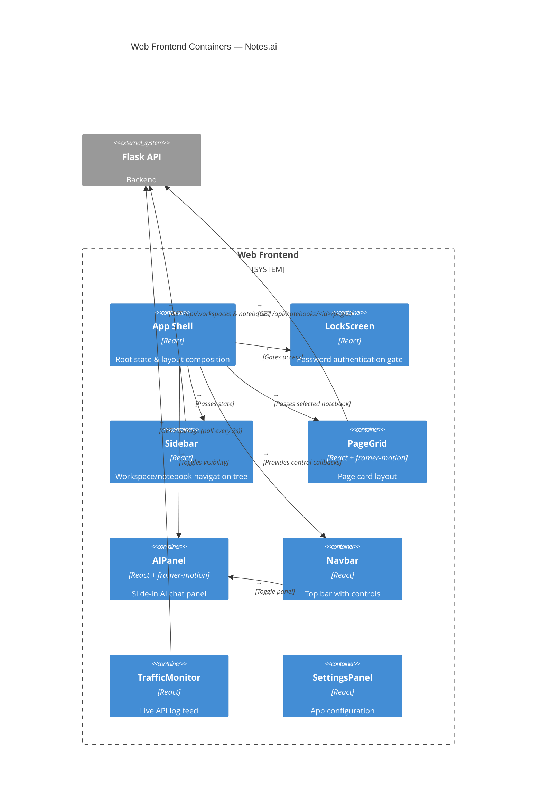

# Notes.ai — Frontend Architecture

_2026-05-26_

---

## Web Frontend Architecture
### Authentication gate component.

Responsibilities:
    - Present a password entry screen on initial load.
    - Validate against a hardcoded access code.
    - Unlock access to the main application on success.
    - Provide animated UI feedback on incorrect attempts.

State:
    - password: string (input buffer)
    - isLocked: bool (gate state)

Interactions:
    - App.jsx: controls whether LockScreen or main App is rendered.

---

### Workspace and notebook navigation tree.

Responsibilities:
    - Display a collapsible tree of workspaces and notebooks.
    - Track expanded/collapsed state per notebook.
    - Highlight the selected notebook.
    - Load notebooks when a workspace is selected.

State:
    - workspaces: list (fetched from API)
    - notebooks: dict (keyed by workspace ID)
    - expandedNotebooks: Set
    - selectedNotebook: string?

Interactions:
    - App.jsx: communicates selection state for PageGrid updates.
    - FlaskAPI: fetches /api/workspaces and /api/workspaces/<id>/notebooks.

---

### Card layout grid of pages within a notebook.

Responsibilities:
    - Render pages as cards with hover animation (framer-motion).
    - Fetch pages when a notebook is selected from Sidebar.
    - Display page title and metadata on each card.

State:
    - pages: list (fetched from API)
    - selectedNotebook: string? (from Sidebar)

Interactions:
    - App.jsx: positioned as the main content area.
    - FlaskAPI: fetches /api/notebooks/<id>/pages.
    - Sidebar: reads selected notebook from shared state.

---

### Slide-in AI chat panel.

Responsibilities:
    - Toggle visibility via Navbar button.
    - Provide an interface for AI interactions (future use).
    - Animate slide-in/out with framer-motion.

State:
    - isOpen: bool

Interactions:
    - Navbar: toggle button triggers open/close.
    - App.jsx: positioned as an overlay panel.

---

### Top application bar with controls.

Responsibilities:
    - Display settings, tools, recording status, and AI toggle.
    - Render a recording pill indicator.
    - Provide global action buttons.

Interactions:
    - AIPanel: toggle button triggers panel visibility.
    - SettingsPanel: opens settings on click.

---

### Live API traffic feed component.

Responsibilities:
    - Poll the FlaskAPI /api/logs endpoint every 2 seconds.
    - Render a scrolling list of recent API requests.
    - Display method, path, status code, and timestamp.

State:
    - logs: list (fetched periodically)

Interactions:
    - FlaskAPI: polls GET /api/logs.
    - Positioned as a floating overlay or sidebar panel.

---

### Root application component.

Responsibilities:
    - Manage top-level state: lock status, workspace/notebook/page selections.
    - Effect: unlock triggers fetch of /api/workspaces.
    - Effect: workspace change triggers fetch of notebooks.
    - Effect: notebook change triggers fetch of pages.
    - Compose LockScreen, Sidebar, Navbar, PageGrid, AIPanel, TrafficMonitor.

State:
    - isLocked, password
    - workspaces, selectedWorkspace
    - notebooks, selectedNotebook
    - pages
    - expandedNotebooks: Set
    - isSelectionMode, isSidebarHidden, isAIPanelOpen

Interactions:
    - All sub-components: passes state as props or via shared context.
    - FlaskAPI: fetches workspace/notebook/page data.

---

### Application settings interface.

Responsibilities:
    - Provide user-facing configuration options.
    - (Future) manage theme, notification, and account settings.

Interactions:
    - Navbar: triggered from settings button.

---

### Architecture Diagram

## Frontend Container Diagram

