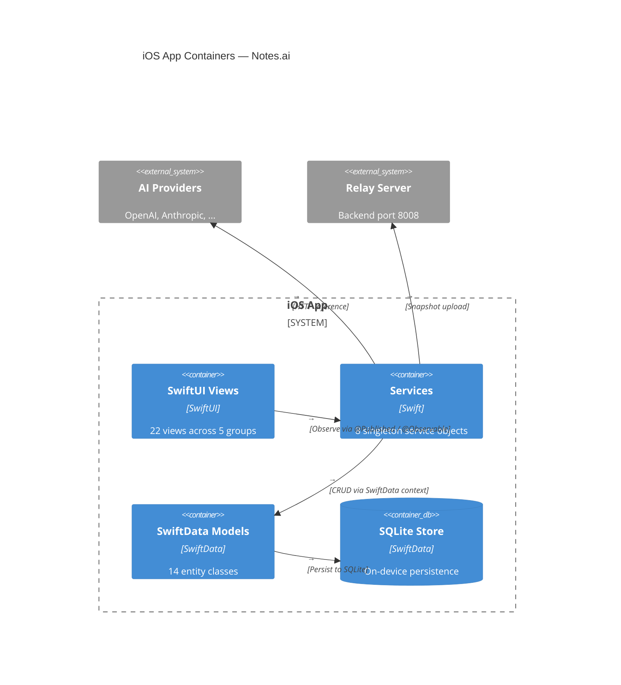

# Notes.ai — iOS App Architecture

_2026-05-26_

---

## iOS Architecture

### SwiftData Models
### Root organizational entity. @Model final class.

Properties: id (UUID), name, accentColor, creationDate, updatedAt,
            serverID (optional), syncStatus
Children: notebooks ([Notebook])

---

### Notebook within a workspace. @Model final class.

Properties: id (UUID), name, creationDate, updatedAt,
            serverID (optional), syncStatus
Relationships: workspace (Workspace?), pages ([Page], cascade delete)

---

### Core note page with PencilKit canvas. @Model final class.

Properties: id (UUID), title, content, creationDate, updatedAt,
            serverID (optional), syncStatus, ocrText,
            backgroundStyle, backgroundColorHex,
            drawingData (PencilKit data, optional)
Children: images ([NoteImage]), textObjects ([NoteText]),
          audioObjects ([AudioObject]), shapeObjects ([ShapeObject]),
          tableObjects ([TableObject]), browserObjects ([BrowserObject]),
          aiSessions ([AIChatSession])

---

### Image overlay on page canvas. @Model final class.

Properties: id (UUID), data (external storage),
            x, y, width, height, zIndex, opacity, isLocked
Parent: page (Page?)

---

### Rich text box on page canvas. @Model final class.

Properties: id (UUID), text,
            x, y, width, height, zIndex,
            fontSize, colorHex, isLocked
Parent: page (Page?)

---

### Audio recording on page. @Model final class.

Properties: id (UUID), data (external storage), transcription,
            x, y, duration, zIndex, isLocked,
            startTime (optional), endTime (optional)
Parent: page (Page?)

---

### Geometric shape on canvas. @Model final class.

Properties: id (UUID), type (circle/rectangle/triangle/etc),
            x, y, width, height, colorHex, isFilled, zIndex
Parent: page (Page?)

---

### Editable table on canvas. @Model final class.

Properties: id (UUID), x, y, rows, cols,
            cellContent ([[String]]), zIndex
Parent: page (Page?)

---

### Embedded web browser on canvas. @Model final class, Identifiable.

Properties: id (UUID), urlString, title,
            x, y, width, height, zIndex,
            opacity, isLocked, createdAt,
            url (computed URL?)
Parent: page (Page?)

---

### AI conversation group. @Model final class.

Properties: id (UUID), title, creationDate, updatedAt
Children: messages ([AIChatMessage], cascade delete),
          associatedPages ([Page])

---

### Single AI chat message. @Model final class.

Properties: id (UUID), role (user/assistant),
            content, imageURL (optional),
            imageDescription (optional), timestamp
Parent: session (AIChatSession?)

---

### Multi-provider AI configuration. Codable, Identifiable, Equatable.

Properties: id (UUID), name, providerType (ProviderType enum),
            apiKey, baseURL, activeModel, availableModels ([String]),
            isActive, temperature, maxTokens,
            customSystemPrompt, visionEnabled, streamingEnabled,
            lastValidated (optional), lastLatency (optional),
            detectedTier (optional), lastError (optional),
            maskedKey (computed)

---

### AI provider type enum — 12 cases.

Cases: openai, anthropic, gemini, groq, openrouter,
       ollama, azure, deepseek, mistral, perplexity,
       nvidia, custom
Each has: displayName, icon, accentColor, defaultBaseURL,
          defaultModel, supportsVision, supportsImageGen,
          isOpenAICompatible, requiresAPIKey, capabilityMatrix

---

```

Workspace (1) ──hasMany──> Notebook (1) ──hasMany──> Page (1)
                                                         │
      ┌──────────────────────────────────────────────────┼──────────────┐
      ▼          ▼          ▼          ▼          ▼          ▼        ▼
 NoteImage  NoteText  AudioObject ShapeObject TableObject  Browser  AIChatSession
                                                                         │
                                                                    AIChatMessage

```

### Services Layer
### Singleton ObservableObject. Orchestrates sync lifecycle.

Responsibilities:
    - Monitor SwiftData store for changes with file watcher.
    - Export live store to snapshot files (.store + .wal + .shm).
    - Probe server connectivity (home IP + Tailscale IP).
    - Upload snapshot triple to RelayServer with retry and backoff.
    - Download cloud snapshots for restore.
    - Clean up old snapshot files from sandbox.

State:
    - status: ConnectionStatus (connecting/connected/offline)
    - isSyncing: Bool
    - snapshotSyncStatus: SnapshotSyncStatus (idle/syncing/success/error)
    - lastSyncTime: Date?
    - syncMode: SyncMode (automatic/manual)

Interactions:
    - AuthService: checks login state before sync.
    - RelayServer: sends snapshot files to POST /* endpoint.
    - FileManager: accesses SwiftData store files.

---

### Singleton ObservableObject. User authentication.

Responsibilities:
    - Login with email/password against backend.
    - Maintain login state and current user profile.
    - Handle logout and session cleanup.

State:
    - isLoggedIn: Bool
    - currentUser: UserProfile?

Interactions:
    - RelayServer: POST /api/auth/login for credential validation.
    - FlaskAPI: GET /api/auth/login as alternative auth path.

---

### Singleton actor. Multi-provider AI prompt routing.

Responsibilities:
    - Send chat messages to active AI provider.
    - Route requests to provider-specific API formats:
      OpenAI-compatible, Anthropic, Gemini, etc.
    - Generate images via DALL-E 3 with Pollinations fallback.
    - Perform OCR via Apple Vision framework (VNRecognizeTextRequest).
    - Resize and encode images to base64 for API requests.
    - Assemble system prompts with page context.

Methods:
    - sendChatMessage(prompt:image:session:) — primary chat entry
    - sendOpenAICompatible(...) — POST /chat/completions
    - sendAnthropic(...) — POST /v1/messages
    - sendGemini(...) — POST /:generateContent
    - generateImage(prompt:useCreativeFallback:) — image generation
    - fetchDALLEImage(...) — POST /images/generations
    - performOCR(image:) — Apple Vision text recognition

Interactions:
    - AIProviderStore: reads active provider configuration.
    - URLSession: sends HTTP requests to provider APIs.
    - Vision framework: on-device OCR processing.

---

### Singleton @MainActor ObservableObject. Provider CRUD and benchmarking.

Responsibilities:
    - Add, update, delete, and activate AI providers.
    - Auto-detect provider type from API key prefix.
    - Benchmark all providers concurrently with latency measurement.
    - Persist provider configurations to UserDefaults.
    - Migrate legacy key storage if needed.

State:
    - providers: [AIProvider]
    - isAnalyzing: Bool
    - analysisProgress: String

Interactions:
    - AIService: supplies active provider for API calls.
    - UserDefaults: reads/writes provider configurations.

---

### Singleton @Observable. AVAudioEngine-based recording.

Responsibilities:
    - Request microphone permissions.
    - Start/stop audio capture with amplitude monitoring.
    - Handle app lifecycle interruptions (background/foreground).
    - Return recorded audio data with duration.

State:
    - isRecording: Bool
    - currentSource: RecordingSource (none/session/aiPrompt)
    - elapsedTime: TimeInterval
    - currentAmplitude: CGFloat

Interactions:
    - AVAudioEngine: core audio capture.
    - AVAudioSession: configuration and interruption handling.
    - TranscriptionService: sends audio for speech-to-text.

---

### Singleton ObservableObject. PencilKit configuration.

Responsibilities:
    - Manage selected drawing tool type, color, and stroke weight.
    - Toggle native tool picker.
    - Set default page background color.
    - Trigger haptic feedback on tool changes.

State:
    - selectedToolType: ToolType (pen/pencil/marker/eraser/lasso)
    - color: Color
    - strokeWeight: StrokeWeight (thin/medium/thick)
    - useNativeToolPicker: Bool
    - defaultPageColorHex: String

Interactions:
    - NoteDetailView.CanvasView: provides PKTool configuration.
    - UIFeedbackGenerator: haptic feedback on tool switch.

---

### Singleton ObservableObject. FaceID/TouchID lock.

Responsibilities:
    - Check biometric availability.
    - Authenticate user via biometric or passcode.
    - Lock/unlock app access.

State:
    - isLocked: Bool
    - isBiometricAvailable: Bool

Interactions:
    - LAContext (LocalAuthentication): biometric authentication.
    - ContentView: gates app access behind lock screen.

---

### Singleton @Observable. Speech-to-text via SFSpeechRecognizer.

Responsibilities:
    - Request speech recognition permissions.
    - Start/stop streaming transcription in real time.
    - Transcribe pre-recorded audio data.

State:
    - isTranscribing: Bool

Interactions:
    - AudioRecorder: receives audio data for transcription.
    - SFSpeechRecognizer: on-device speech-to-text.

---

### SwiftUI Views
**Root:**
- ContentView — NavigationSplitView with workspace switcher**Note Editing:**
- NoteDetailView — main PencilKit canvas with all object overlays- CanvasView — UIViewRepresentable wrapping PKCanvasView- NoteImageView — image overlay on canvas- Coordinator — PKCanvasView delegate (tool picker, drawing)- PageHeaderToolbar — top toolbar (insert, draw, page actions)- PageToolbar — DEPRECATED drawing toolbar (returns EmptyView)- PageBackgroundView — lined/grid/blank background renderer- LinedPattern — line background shape- GridPattern — grid background shape- PageCanvasObjectsLayer — Z-sorted overlay of all canvas objects- NoteTextView — resizable rich text box on canvas- ShapeView — universal shape renderer- TableView — editable grid table on canvas- AudioObjectView — audio playback widget- PlaybackDelegate — AVAudioPlayer delegate- WaveformView — live audio amplitude bars- MiniBrowserView — embedded WKWebView- WebView — UIViewRepresentable for WKWebView- FullScreenImageView — AI-generated image viewer- RegionSelectorOverlay — drag-to-select rectangle**Ai:**
- AIProviderSettingsView — multi-step provider add/edit- ActiveProviderCard — active provider summary card- ProviderRow — provider row in list- AddProviderSheet — add provider form sheet- EditProviderSheet — edit provider form sheet- CompareProvidersView — capability matrix comparison- CapabilityCard — per-provider capability card- EngineComparisonColumn — provider comparison column- ScoreRow — capability score row- PageContextSelector — AI chat context page picker- AppSettingsSheet — theme, security, page defaults**Auth Settings:**
- LoginSheet — email/password login form- AccountSettingsView — user profile + sync mode- CloudSettingsView — cloud workspace browser- PageInfoSheet — media/content metadata sheet**Shapes:**
- FlowLayout — custom Layout for wrapping items- TriangleShape, StarShape, HexagonShape, DiamondShape- ArrowShape, XYAxisShape, XYZAxisShape- NumberLineShape, ParabolaShape- SineWaveShape, VectorArrowShape — all Shape protocol### Architecture Diagram


## iOS App Container Diagram



