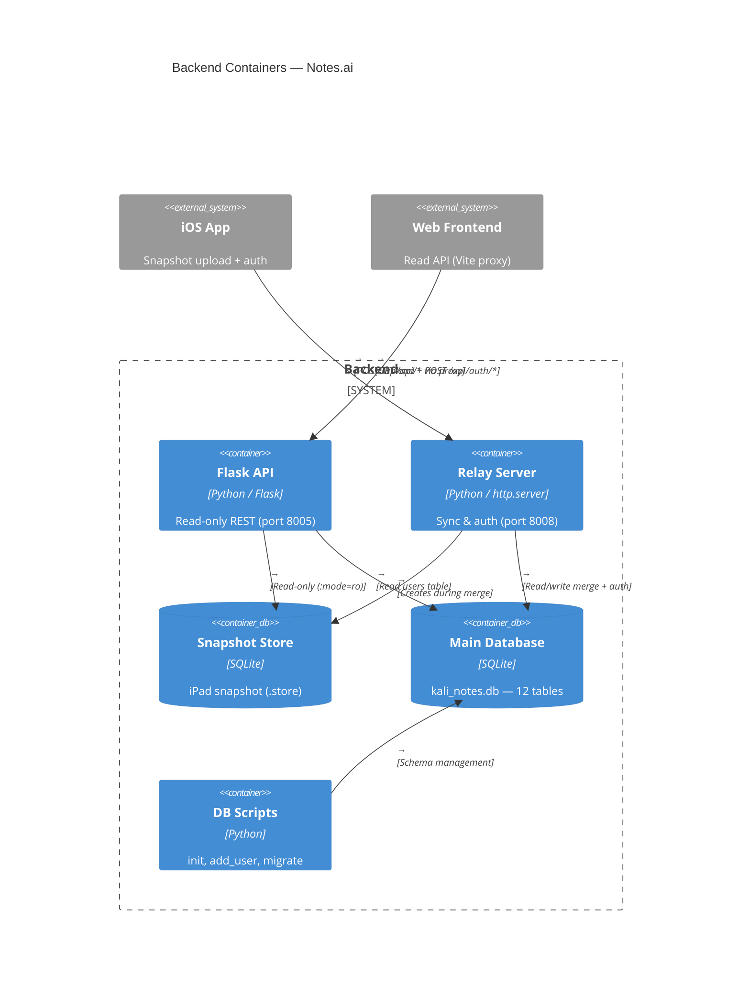
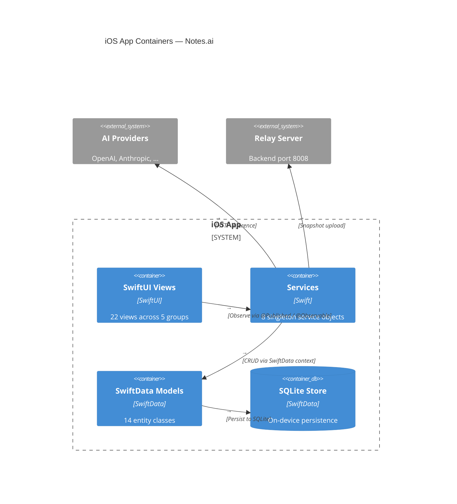
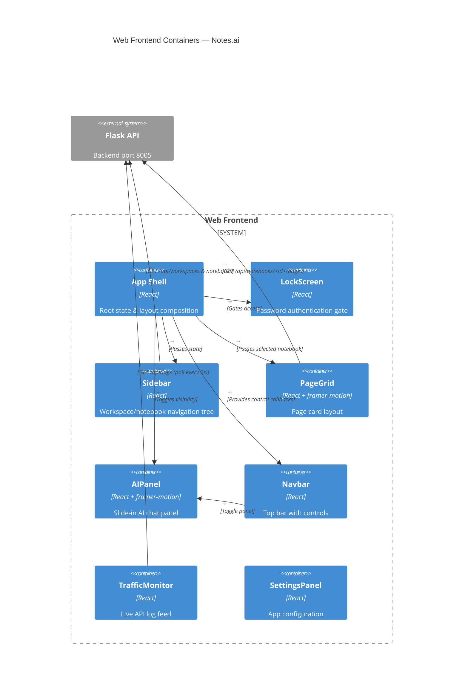
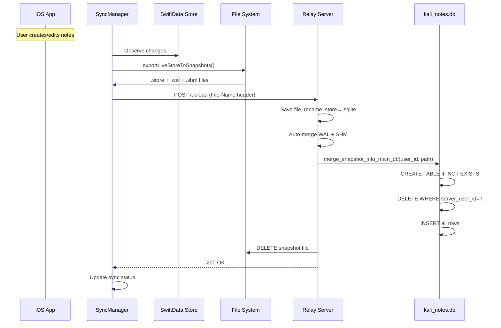
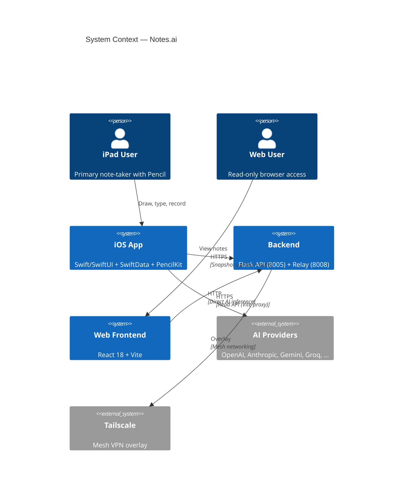
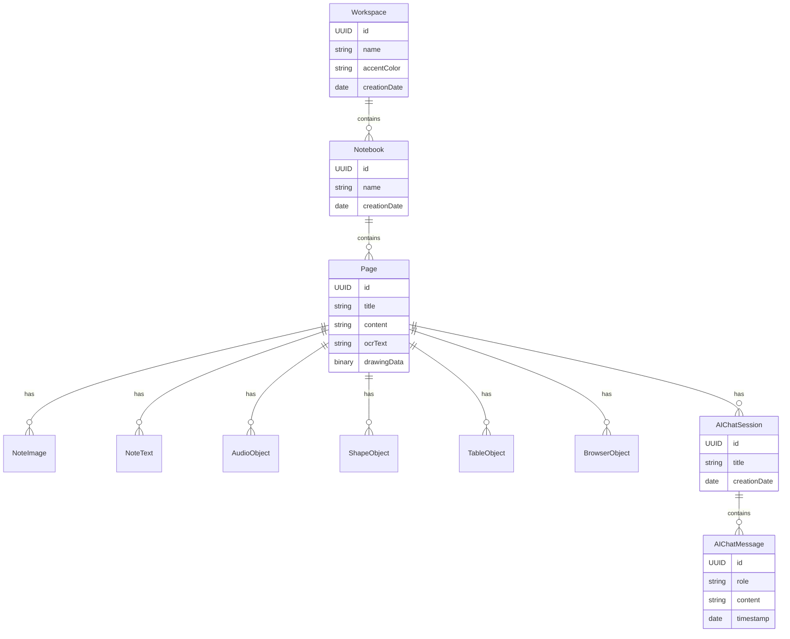
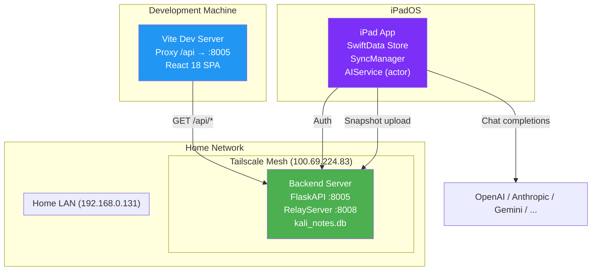

# Notes.ai — System Architecture Documentation

> Generated by `archgen` — an abstract, non-proprietary description of
> the system's components, responsibilities, and data flows.

**Date:** 2026-05-26
**Version:** 2.0.0

---


## 1. System Overview

## System Architecture

Notes.ai is composed of three codebases that form a unified note-taking
platform with offline-first iOS at the center:

┌────────────────────────────────────────────────────────────┐
│                     iOS App (iPad)                          │
│   Swift/SwiftUI — MVVM with SwiftData + PencilKit          │
│                                                            │
│   ┌──────────┐  ┌──────────┐  ┌───────────────────────┐   │
│   │  Views    │  │ Services  │  │  SwiftData Models     │   │
│   │(22 views) │  │ (8 svcs)  │  │  (14 entity classes)  │   │
│   └─────┬────┘  └─────┬────┘  └───────────┬───────────┘   │
│         │              │                   │               │
│         └──────┬───────┴───────────────────┘               │
│                │                                           │
│                │  SQLite snapshot (.store file)             │
└────────────────┼───────────────────────────────────────────┘
                 │
                 │ HTTP POST /upload (snapshot sync)
                 │ HTTP GET /api/* (read-only data access)
                 │ HTTP POST /api/auth/* (authentication)
                 ▼
┌────────────────────────────────────────────────────────────┐
│                      Backend                                │
│   Flask/Python — Two-server architecture                    │
│                                                            │
│   ┌─────────────────┐      ┌──────────────────────┐        │
│   │  Flask API       │      │  Relay Server         │       │
│   │  (port 8005)     │      │  (port 8008)          │       │
│   │  Read-only data  │      │  Snapshot ingest      │       │
│   │  GET endpoints   │      │  Auth endpoints       │       │
│   └────────┬────────┘      └───────────┬──────────┘        │
│            │                           │                   │
│            └───────────┬───────────────┘                   │
│                        ▼                                   │
│              ┌──────────────────┐                          │
│              │   SQLite (kali_notes.db) — 12 tables        │
│              └──────────────────┘                          │
└──────────────┼─────────────────────────────────────────────┘
               │
               │ Vite proxy /api/* → localhost:8005
               ▼
┌────────────────────────────────────────────────────────────┐
│                   Web Frontend                              │
│   React 18 + Vite — Single-page application                │
│                                                            │
│   ┌──────────┐  ┌──────────┐  ┌───────────────────────┐   │
│   │ LockScreen│  │  Sidebar  │  │  PageGrid / AIPanel   │   │
│   │  Auth     │  │ Navigation│  │  + TrafficMonitor     │   │
│   └──────────┘  └──────────┘  └───────────────────────┘   │
└────────────────────────────────────────────────────────────┘
---
## 2. Deployment Boundaries
### Ios
- **Deployment:** Xcode project (Kali Notes.xcodeproj), iPadOS target- **Language:** Swift 5.9+- **Framework:** SwiftUI + SwiftData- **Sync:** SQLite snapshot upload (export live store → HTTP POST)- **Auth:** Email/password (custom), biometric (FaceID/TouchID)### Backend
- **Deployment:** Python scripts on home server / Tailscale mesh- **Language:** Python 3.x- **Servers:** Flask API (port 8005), Relay Server (port 8008)- **Database:** SQLite (kali_notes.db) — 12 tables- **Protocols:** HTTP REST, SQLite direct access### Frontend
- **Deployment:** Vite dev server / static build- **Language:** JavaScript (JSX, React 18)- **Bundler:** Vite 5- **Dependencies:** framer-motion, lucide-react---
## 3. Backend Modules
### Read-only REST API server (port 8005).

Responsibilities:
    - Serve read-only GET endpoints over note hierarchy data.
    - Read from the latest iPad snapshot (.store file) with SQLite read-only mode.
    - Authenticate users via email/password lookup in the users table.
    - Log all traffic with timestamps and status codes (ring buffer, max 50).
    - Serve the private/shared web interface.

Routes:
    - GET /api/workspaces — list all workspaces (source: ZWORKSPACE)
    - GET /api/workspaces/<id>/notebooks — list notebooks in workspace (source: ZNOTEBOOK)
    - GET /api/notebooks/<id>/pages — list pages in notebook (source: ZPAGE)
    - POST /upload — receive .store snapshot file (header: File-Name)
    - POST /api/auth/login — validate email/password credentials
    - GET /api/logs — return recent traffic log entries
    - GET /private — serve the private/shared index page

Interactions:
    - Reads snapshot SQLite store for note data.
    - Reads kali_notes.db for user authentication.
    - Proxied by Vite frontend dev server for cross-origin requests.

---

### Sync relay and authentication server (port 8008).

Responsibilities:
    - Receive iPad SQLite snapshot uploads via POST.
    - Auto-merge SQLite WAL + SHM files on receipt.
    - Merge snapshot tables into the main kali_notes.db.
    - Serve cloud workspace listing, download, and delete endpoints.
    - Handle user registration and login authentication.

Endpoints:
    - GET /api/sync/list — list available snapshot timestamps and files
    - GET /api/cloud/workspaces — alias for sync/list
    - GET /api/sync/download?timestamp=&ext= — download snapshot file
    - GET /api/cloud/download?timestamp=&ext= — alias for cloud download
    - GET /api/cloud/metadata — simple health check
    - POST /api/auth/login — authenticate existing user
    - POST /api/auth/signup — register new user
    - POST /* (catch-all) — save uploaded file, trigger merge pipeline
    - DELETE /api/sync/delete?timestamp= — remove snapshot triple
    - DELETE /api/cloud/delete?timestamp= — alias for sync delete
    - OPTIONS * — CORS preflight response

Interactions:
    - Receives snapshot files from iOS SyncManager.
    - Merges snapshot data into kali_notes.db with server_user_id tagging.
    - Shares the same kali_notes.db file with the Flask API server.

---

### SQLite database — 12 tables storing all application data.

Responsibilities:
    - Store user accounts with email and password.
    - Persist workspace/notebook/page hierarchy.
    - Store page content objects: images, text, audio, shapes, tables, browser embeds.
    - Save AI chat sessions and messages with role/content pairs.
    - Tag all records with server_user_id for multi-tenant isolation.

Tables:
    - users: id, email, password, created_at
    - ZWORKSPACE: workspace nodes with name, accent color, sync metadata
    - ZNOTEBOOK: notebooks within workspaces, with FK to ZWORKSPACE
    - ZPAGE: pages within notebooks, with PencilKit drawing data blob
    - ZNOTETEXT: text boxes placed on page canvas
    - ZNOTEIMAGE: image overlays with position and opacity
    - ZAUDIOOBJECT: audio recordings with transcription
    - ZSHAPEOBJECT: geometric shapes with type, color, fill
    - ZTABLEOBJECT: editable grid tables with cell content
    - ZBROWSEROBJECT: embedded web browser instances
    - ZAICHATSESSION: AI conversation groups
    - ZAICHATMESSAGE: individual messages in AI chat

Interactions:
    - Read by FlaskAPI for GET endpoints.
    - Read/Write by RelayServer for snapshot merge and auth.

---

### Utility scripts for database management.

Responsibilities:
    - Initialize the users table with schema and demo user.
    - Add or update user accounts via command line.
    - Apply schema migrations to the database.

Scripts:
    - init_users_db.py: init_db() — CREATE TABLE IF NOT EXISTS users, seed demo user
    - add_user.py: add_user(email, password) — INSERT or UPDATE user password
    - migrate_db.py: migrate() — ALTER TABLE to add columns

Interactions:
    - Operate directly on kali_notes.db.
    - Called manually or during setup.

---

### Backend Architecture Diagram


## Backend Container Diagram



---
## 4. iOS App Modules
### 4a. SwiftData Models
### Root organizational entity. @Model final class.

Properties: id (UUID), name, accentColor, creationDate, updatedAt,
            serverID (optional), syncStatus
Children: notebooks ([Notebook])

---

### Notebook within a workspace. @Model final class.

Properties: id (UUID), name, creationDate, updatedAt,
            serverID (optional), syncStatus
Relationships: workspace (Workspace?), pages ([Page], cascade delete)

---

### Core note page with PencilKit canvas. @Model final class.

Properties: id (UUID), title, content, creationDate, updatedAt,
            serverID (optional), syncStatus, ocrText,
            backgroundStyle, backgroundColorHex,
            drawingData (PencilKit data, optional)
Children: images ([NoteImage]), textObjects ([NoteText]),
          audioObjects ([AudioObject]), shapeObjects ([ShapeObject]),
          tableObjects ([TableObject]), browserObjects ([BrowserObject]),
          aiSessions ([AIChatSession])

---

### Image overlay on page canvas. @Model final class.

Properties: id (UUID), data (external storage),
            x, y, width, height, zIndex, opacity, isLocked
Parent: page (Page?)

---

### Rich text box on page canvas. @Model final class.

Properties: id (UUID), text,
            x, y, width, height, zIndex,
            fontSize, colorHex, isLocked
Parent: page (Page?)

---

### Audio recording on page. @Model final class.

Properties: id (UUID), data (external storage), transcription,
            x, y, duration, zIndex, isLocked,
            startTime (optional), endTime (optional)
Parent: page (Page?)

---

### Geometric shape on canvas. @Model final class.

Properties: id (UUID), type (circle/rectangle/triangle/etc),
            x, y, width, height, colorHex, isFilled, zIndex
Parent: page (Page?)

---

### Editable table on canvas. @Model final class.

Properties: id (UUID), x, y, rows, cols,
            cellContent ([[String]]), zIndex
Parent: page (Page?)

---

### Embedded web browser on canvas. @Model final class, Identifiable.

Properties: id (UUID), urlString, title,
            x, y, width, height, zIndex,
            opacity, isLocked, createdAt,
            url (computed URL?)
Parent: page (Page?)

---

### AI conversation group. @Model final class.

Properties: id (UUID), title, creationDate, updatedAt
Children: messages ([AIChatMessage], cascade delete),
          associatedPages ([Page])

---

### Single AI chat message. @Model final class.

Properties: id (UUID), role (user/assistant),
            content, imageURL (optional),
            imageDescription (optional), timestamp
Parent: session (AIChatSession?)

---

### Multi-provider AI configuration. Codable, Identifiable, Equatable.

Properties: id (UUID), name, providerType (ProviderType enum),
            apiKey, baseURL, activeModel, availableModels ([String]),
            isActive, temperature, maxTokens,
            customSystemPrompt, visionEnabled, streamingEnabled,
            lastValidated (optional), lastLatency (optional),
            detectedTier (optional), lastError (optional),
            maskedKey (computed)

---

### AI provider type enum — 12 cases.

Cases: openai, anthropic, gemini, groq, openrouter,
       ollama, azure, deepseek, mistral, perplexity,
       nvidia, custom
Each has: displayName, icon, accentColor, defaultBaseURL,
          defaultModel, supportsVision, supportsImageGen,
          isOpenAICompatible, requiresAPIKey, capabilityMatrix

---

### Model Hierarchy
```

Workspace (1) ──hasMany──> Notebook (1) ──hasMany──> Page (1)
                                                         │
      ┌──────────────────────────────────────────────────┼──────────────┐
      ▼          ▼          ▼          ▼          ▼          ▼        ▼
 NoteImage  NoteText  AudioObject ShapeObject TableObject  Browser  AIChatSession
                                                                         │
                                                                    AIChatMessage

```
### 4b. Services Layer
### Singleton ObservableObject. Orchestrates sync lifecycle.

Responsibilities:
    - Monitor SwiftData store for changes with file watcher.
    - Export live store to snapshot files (.store + .wal + .shm).
    - Probe server connectivity (home IP + Tailscale IP).
    - Upload snapshot triple to RelayServer with retry and backoff.
    - Download cloud snapshots for restore.
    - Clean up old snapshot files from sandbox.

State:
    - status: ConnectionStatus (connecting/connected/offline)
    - isSyncing: Bool
    - snapshotSyncStatus: SnapshotSyncStatus (idle/syncing/success/error)
    - lastSyncTime: Date?
    - syncMode: SyncMode (automatic/manual)

Interactions:
    - AuthService: checks login state before sync.
    - RelayServer: sends snapshot files to POST /* endpoint.
    - FileManager: accesses SwiftData store files.

---

### Singleton ObservableObject. User authentication.

Responsibilities:
    - Login with email/password against backend.
    - Maintain login state and current user profile.
    - Handle logout and session cleanup.

State:
    - isLoggedIn: Bool
    - currentUser: UserProfile?

Interactions:
    - RelayServer: POST /api/auth/login for credential validation.
    - FlaskAPI: GET /api/auth/login as alternative auth path.

---

### Singleton actor. Multi-provider AI prompt routing.

Responsibilities:
    - Send chat messages to active AI provider.
    - Route requests to provider-specific API formats:
      OpenAI-compatible, Anthropic, Gemini, etc.
    - Generate images via DALL-E 3 with Pollinations fallback.
    - Perform OCR via Apple Vision framework (VNRecognizeTextRequest).
    - Resize and encode images to base64 for API requests.
    - Assemble system prompts with page context.

Methods:
    - sendChatMessage(prompt:image:session:) — primary chat entry
    - sendOpenAICompatible(...) — POST /chat/completions
    - sendAnthropic(...) — POST /v1/messages
    - sendGemini(...) — POST /:generateContent
    - generateImage(prompt:useCreativeFallback:) — image generation
    - fetchDALLEImage(...) — POST /images/generations
    - performOCR(image:) — Apple Vision text recognition

Interactions:
    - AIProviderStore: reads active provider configuration.
    - URLSession: sends HTTP requests to provider APIs.
    - Vision framework: on-device OCR processing.

---

### Singleton @MainActor ObservableObject. Provider CRUD and benchmarking.

Responsibilities:
    - Add, update, delete, and activate AI providers.
    - Auto-detect provider type from API key prefix.
    - Benchmark all providers concurrently with latency measurement.
    - Persist provider configurations to UserDefaults.
    - Migrate legacy key storage if needed.

State:
    - providers: [AIProvider]
    - isAnalyzing: Bool
    - analysisProgress: String

Interactions:
    - AIService: supplies active provider for API calls.
    - UserDefaults: reads/writes provider configurations.

---

### Singleton @Observable. AVAudioEngine-based recording.

Responsibilities:
    - Request microphone permissions.
    - Start/stop audio capture with amplitude monitoring.
    - Handle app lifecycle interruptions (background/foreground).
    - Return recorded audio data with duration.

State:
    - isRecording: Bool
    - currentSource: RecordingSource (none/session/aiPrompt)
    - elapsedTime: TimeInterval
    - currentAmplitude: CGFloat

Interactions:
    - AVAudioEngine: core audio capture.
    - AVAudioSession: configuration and interruption handling.
    - TranscriptionService: sends audio for speech-to-text.

---

### Singleton ObservableObject. PencilKit configuration.

Responsibilities:
    - Manage selected drawing tool type, color, and stroke weight.
    - Toggle native tool picker.
    - Set default page background color.
    - Trigger haptic feedback on tool changes.

State:
    - selectedToolType: ToolType (pen/pencil/marker/eraser/lasso)
    - color: Color
    - strokeWeight: StrokeWeight (thin/medium/thick)
    - useNativeToolPicker: Bool
    - defaultPageColorHex: String

Interactions:
    - NoteDetailView.CanvasView: provides PKTool configuration.
    - UIFeedbackGenerator: haptic feedback on tool switch.

---

### Singleton ObservableObject. FaceID/TouchID lock.

Responsibilities:
    - Check biometric availability.
    - Authenticate user via biometric or passcode.
    - Lock/unlock app access.

State:
    - isLocked: Bool
    - isBiometricAvailable: Bool

Interactions:
    - LAContext (LocalAuthentication): biometric authentication.
    - ContentView: gates app access behind lock screen.

---

### Singleton @Observable. Speech-to-text via SFSpeechRecognizer.

Responsibilities:
    - Request speech recognition permissions.
    - Start/stop streaming transcription in real time.
    - Transcribe pre-recorded audio data.

State:
    - isTranscribing: Bool

Interactions:
    - AudioRecorder: receives audio data for transcription.
    - SFSpeechRecognizer: on-device speech-to-text.

---

### 4c. SwiftUI Views
**Root:**
- ContentView — NavigationSplitView with workspace switcher**Note Editing:**
- NoteDetailView — main PencilKit canvas with all object overlays- CanvasView — UIViewRepresentable wrapping PKCanvasView- NoteImageView — image overlay on canvas- Coordinator — PKCanvasView delegate (tool picker, drawing)- PageHeaderToolbar — top toolbar (insert, draw, page actions)- PageToolbar — DEPRECATED drawing toolbar (returns EmptyView)- PageBackgroundView — lined/grid/blank background renderer- LinedPattern — line background shape- GridPattern — grid background shape- PageCanvasObjectsLayer — Z-sorted overlay of all canvas objects- NoteTextView — resizable rich text box on canvas- ShapeView — universal shape renderer- TableView — editable grid table on canvas- AudioObjectView — audio playback widget- PlaybackDelegate — AVAudioPlayer delegate- WaveformView — live audio amplitude bars- MiniBrowserView — embedded WKWebView- WebView — UIViewRepresentable for WKWebView- FullScreenImageView — AI-generated image viewer- RegionSelectorOverlay — drag-to-select rectangle**Ai:**
- AIProviderSettingsView — multi-step provider add/edit- ActiveProviderCard — active provider summary card- ProviderRow — provider row in list- AddProviderSheet — add provider form sheet- EditProviderSheet — edit provider form sheet- CompareProvidersView — capability matrix comparison- CapabilityCard — per-provider capability card- EngineComparisonColumn — provider comparison column- ScoreRow — capability score row- PageContextSelector — AI chat context page picker- AppSettingsSheet — theme, security, page defaults**Auth Settings:**
- LoginSheet — email/password login form- AccountSettingsView — user profile + sync mode- CloudSettingsView — cloud workspace browser- PageInfoSheet — media/content metadata sheet**Shapes:**
- FlowLayout — custom Layout for wrapping items- TriangleShape, StarShape, HexagonShape, DiamondShape- ArrowShape, XYAxisShape, XYZAxisShape- NumberLineShape, ParabolaShape- SineWaveShape, VectorArrowShape — all Shape protocol### iOS Architecture Diagram


## iOS App Container Diagram



---
## 5. Web Frontend Modules
### Authentication gate component.

Responsibilities:
    - Present a password entry screen on initial load.
    - Validate against a hardcoded access code.
    - Unlock access to the main application on success.
    - Provide animated UI feedback on incorrect attempts.

State:
    - password: string (input buffer)
    - isLocked: bool (gate state)

Interactions:
    - App.jsx: controls whether LockScreen or main App is rendered.

---

### Workspace and notebook navigation tree.

Responsibilities:
    - Display a collapsible tree of workspaces and notebooks.
    - Track expanded/collapsed state per notebook.
    - Highlight the selected notebook.
    - Load notebooks when a workspace is selected.

State:
    - workspaces: list (fetched from API)
    - notebooks: dict (keyed by workspace ID)
    - expandedNotebooks: Set
    - selectedNotebook: string?

Interactions:
    - App.jsx: communicates selection state for PageGrid updates.
    - FlaskAPI: fetches /api/workspaces and /api/workspaces/<id>/notebooks.

---

### Card layout grid of pages within a notebook.

Responsibilities:
    - Render pages as cards with hover animation (framer-motion).
    - Fetch pages when a notebook is selected from Sidebar.
    - Display page title and metadata on each card.

State:
    - pages: list (fetched from API)
    - selectedNotebook: string? (from Sidebar)

Interactions:
    - App.jsx: positioned as the main content area.
    - FlaskAPI: fetches /api/notebooks/<id>/pages.
    - Sidebar: reads selected notebook from shared state.

---

### Slide-in AI chat panel.

Responsibilities:
    - Toggle visibility via Navbar button.
    - Provide an interface for AI interactions (future use).
    - Animate slide-in/out with framer-motion.

State:
    - isOpen: bool

Interactions:
    - Navbar: toggle button triggers open/close.
    - App.jsx: positioned as an overlay panel.

---

### Top application bar with controls.

Responsibilities:
    - Display settings, tools, recording status, and AI toggle.
    - Render a recording pill indicator.
    - Provide global action buttons.

Interactions:
    - AIPanel: toggle button triggers panel visibility.
    - SettingsPanel: opens settings on click.

---

### Live API traffic feed component.

Responsibilities:
    - Poll the FlaskAPI /api/logs endpoint every 2 seconds.
    - Render a scrolling list of recent API requests.
    - Display method, path, status code, and timestamp.

State:
    - logs: list (fetched periodically)

Interactions:
    - FlaskAPI: polls GET /api/logs.
    - Positioned as a floating overlay or sidebar panel.

---

### Root application component.

Responsibilities:
    - Manage top-level state: lock status, workspace/notebook/page selections.
    - Effect: unlock triggers fetch of /api/workspaces.
    - Effect: workspace change triggers fetch of notebooks.
    - Effect: notebook change triggers fetch of pages.
    - Compose LockScreen, Sidebar, Navbar, PageGrid, AIPanel, TrafficMonitor.

State:
    - isLocked, password
    - workspaces, selectedWorkspace
    - notebooks, selectedNotebook
    - pages
    - expandedNotebooks: Set
    - isSelectionMode, isSidebarHidden, isAIPanelOpen

Interactions:
    - All sub-components: passes state as props or via shared context.
    - FlaskAPI: fetches workspace/notebook/page data.

---

### Application settings interface.

Responsibilities:
    - Provide user-facing configuration options.
    - (Future) manage theme, notification, and account settings.

Interactions:
    - Navbar: triggered from settings button.

---

### Frontend Architecture Diagram


## Frontend Container Diagram



---
## 6. End-to-End Data Flows

## End-to-End Data Flow

┌──────────────────────────────────────────────────────────────────────┐
│                           iOS App (iPad)                             │
│                                                                      │
│  ┌──────────────┐     ┌─────────────────┐     ┌──────────────────┐  │
│  │ SwiftData     │────►│ SyncManager     │────►│ POST /upload     │  │
│  │ Store         │     │ exportLiveStore │     │ (.store + WAL)   │  │
│  │ (live)        │     │ toSnapshots()   │     │                  │  │
│  └──────────────┘     └─────────────────┘     └────────┬─────────┘  │
│                                                        │            │
│  ┌──────────────┐     ┌─────────────────┐              │            │
│  │ AIService     │     │ AuthService     │              │            │
│  │ (actor,       │     │ (ObservableObj) │              │            │
│  │ multi-provider)    │ email/password  │              │            │
│  └──────┬───────┘     └────────┬────────┘              │            │
│         │                      │                       │            │
└─────────┼──────────────────────┼───────────────────────┼────────────┘
          │                      │                       │
          │ AI API calls         │ POST /api/auth/login  │ HTTP snapshot
          ▼                      ▼                       ▼
┌──────────────────────────────────────────────────────────────────────┐
│                          Backend                                     │
│                                                                      │
│  ┌──────────────────────┐     ┌──────────────────────────────┐      │
│  │ FlaskAPI (port 8005)  │     │ RelayServer (port 8008)      │      │
│  │ Read-only GET enpoints│     │ Upload + merge + auth        │      │
│  │ iPad_snapshot.store   │     │ merge_snapshot_into_main_db()│      │
│  └──────────┬───────────┘     └──────────────┬───────────────┘      │
│             │                                │                       │
│             └──────────┬─────────────────────┘                       │
│                        ▼                                             │
│              ┌─────────────────────┐                                 │
│              │  kali_notes.db       │                                 │
│              │  12 tables           │                                 │
│              │  server_user_id tags │                                 │
│              └─────────────────────┘                                 │
└──────────────────────┬───────────────────────────────────────────────┘
                       │
          Vite proxy /api/* → localhost:8005
                       ▼
┌──────────────────────────────────────────────────────────────────────┐
│                      Web Frontend                                    │
│  React 18 + Vite + framer-motion + lucide-react                     │
│                                                                      │
│  ┌──────────┐  ┌──────────┐  ┌──────────┐  ┌──────────────────┐    │
│  │ LockScreen│  │ Sidebar  │  │ PageGrid │  │ TrafficMonitor   │    │
│  │ (auth)   │  │ (nav)    │  │ (content)│  │ (polls /api/logs) │   │
│  └──────────┘  └──────────┘  └──────────┘  └──────────────────┘    │
│  ┌──────────┐  ┌──────────┐                                         │
│  │ AIPanel  │  │ Navbar   │                                         │
│  │ (chat)   │  │ (controls)                                         │
│  └──────────┘  └──────────┘                                         │
└──────────────────────────────────────────────────────────────────────┘

### iPad snapshot upload → RelayServer merge → kali_notes.db.

This is the primary write path — all data originates on the iPad.

Steps:
    1. SyncManager detects SwiftData store changes.
    2. SyncManager.exportLiveStoreToSnapshots() copies the SwiftData
       store file (default.store) to iPad_snapshot.store, plus its
       .wal and .shm companion files.
    3. SyncManager.uploadFileSilently() sends a POST /upload request
       to the RelayServer with the .store file, setting File-Name header.
    4. RelayServer saves the file to its UPLOAD_DIR, renames .store → .sqlite.
    5. RelayServer auto-merges WAL: if .sqlite-wal exists, forces SQLite
       to merge WAL + SHM into the main .sqlite file.
    6. merge_snapshot_into_main_db() is called with user_id and snapshot path:
       a. For each non-internal table (ZWORKSPACE, ZNOTEBOOK, ZPAGE, etc.):
          - CREATE TABLE IF NOT EXISTS in kali_notes.db
          - DELETE existing rows WHERE server_user_id = user_id
          - INSERT all rows with server_user_id tag
    7. Snapshot file is deleted after successful merge.
    8. kali_notes.db now reflects the latest iPad state.

---

### Client reads data through FlaskAPI from the latest snapshot.

Steps:
    1. Client (frontend or iOS) sends GET request to FlaskAPI endpoint.
    2. FlaskAPI opens iPad_snapshot.store in read-only mode (:mode=ro).
    3. SQLite query is executed against the snapshot tables.
    4. Results are serialized to JSON and returned to the client.
    5. Client renders the data (page grid, notebook tree, etc.).

---

### User authentication via RelayServer.

Steps:
    1. Client sends POST /api/auth/login with email and password.
    2. RelayServer queries the users table in kali_notes.db.
    3. If email + password match, returns {success: true, user: {...}}.
    4. Client stores the user session and navigates to the main app.
    5. On signup: POST /api/auth/signup creates a new user record.

---

### iOS-only AI chat with multi-provider routing.

Steps:
    1. User opens AI chat on a Page in NoteDetailView.
    2. AIService captures context:
       a. Canvas drawing → composite UIImage (max 1024px).
       b. Vision OCR stream via performLocalOCR.
       c. Notebook/Page metadata from SwiftData models.
    3. AIService reads active provider from AIProviderStore.
    4. AIService routes the request to the correct provider API:
       - OpenAI-compatible: POST /chat/completions
       - Anthropic: POST /v1/messages
       - Gemini: POST /:generateContent
    5. Response is saved as AIChatMessage in the current AIChatSession.
    6. Image generation (optional):
       - Primary: DALL-E 3 via fetchDALLEImage
       - Fallback: Pollinations Flux via fetchPollinationsURL

---

### Restore iPad from cloud snapshot.

Steps:
    1. User navigates to CloudSettingsView in the iOS app.
    2. SyncManager calls GET /api/cloud/workspaces to list snapshots.
    3. User selects a snapshot to restore.
    4. SyncManager calls GET /api/cloud/download?timestamp=&ext=.
    5. RelayServer returns the raw snapshot file.
    6. SyncManager saves and applies the snapshot to the local SwiftData store.

---

### Sync Sequence Diagram


## Snapshot Sync Sequence



---
## 7. Architecture Diagrams


## System Context Diagram




## SwiftData Model Hierarchy




## Deployment Architecture



